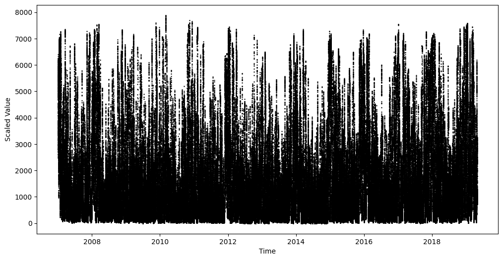

# Simulating Wind Power Generation

Wind power has a low environmental impact and is inexhaustible, making it an important renewable energy source. However, the generation of wind power is highly dependent on weather conditions. Systems that utilize wind power must be robust against these fluctuations. This project aims to enable the testing of such systems by simulating wind power generation using Generative Adversarial Networks (GANs) to generate daily power generation profiles under different weather conditions/regimes modeled by a Hidden Markov Model (HMM).

## Data

Daily total wind power generation in Germany from 2008 to 2019 in 15 minute intervals. Source:
Open Power System Data. 2019. Data Package Time series. Version 2019-06-05. [https://doi.org/10.25832/time_series/2019-06-05](https://doi.org/10.25832/time_series/2019-06-05). (Primary data from various sources, for a complete list see URL).

## Preprocessing

The figure below shows the total wind power generation in Germany from 2008 to 2019. 

Because of the construction of more wind turbines, the peak power generation has increased over the years. To predict consistent regimes and generate comparable power generation profiles, the following preprocessing steps were applied:

1. **Log Transformation**: The data was log-transformed to make exponential growth linear.
2. **Linear Detrending**: A linear trend was removed from the data to make the data stationary, by fitting and subtracting a linear regression model to a rolling 99th percentile using a window size of 3 days.
3. **Exponential Transformation**: The detrended data was exponentially transformed to revert the log transformation.

The figure below shows the detrended wind power generation in Germany from 2008 to 2019.

## Hidden Markov Model (HMM)

Two predict current regimes in the wind power generation two features are used:

1. **Rolling Average Difference**: The rolling average of the difference between 15-minute intervals using a window size of 3 times 96 intervals (3 days).

2. **Rolling Standard Deviation**: The rolling standard deviation of the 15-minute intervals using a window size of 3 times 96 intervals (3 days).

A Hidden Markov Model (HMM) using 2 states was trained on the features to predict the current regime. The figure below shows the predicted regimes for the detrended wind power generation in 2017.

## Generative Adversarial Networks (GANs)

For each regime, a GAN was trained to generate daily power generation profiles (96 intervals) under the respective regime. 

### Generator Architecture

The generator creates profiles based on the input noise vector `z`, which has a dimension of 100 x 1 x 1. The architecture consists of several transposed convolution layers followed by residual blocks. To prevent the generator from collapsing and always producing the same output, 9 outputs are generated at once and fed to the discriminator. Below is a detailed breakdown of the generator architecture:

1. Transposed convolution with 8 channels, kernel size (1, 12) and stride (1, 1) to transform the input noise vector to 8 x 1 x 12, batch normalization, and ReLU activation.
2. Transposed convolution with 16 channels, kernel size (1, 12) and stride (1, 3) to transform the input to 16 x 1 x 45, batch normalization, and ReLU activation.
3. Transposed convolution with 32 channels, kernel size (1, 12) and stride (1, 3) to transform the input to 32 x 1 x 144, batch normalization, and ReLU activation.
4. Transposed convolution with 16 channels, kernel size (3, 1) and stride (3, 1) to transform the input to 16 x 3 x 144, batch normalization, and ReLU activation.
5. Transposed convolution with 8 channels, kernel size (3, 1) and stride (3, 1) to transform the input to 8 x 9 x 144, batch normalization, and ReLU activation.
6. Transposed convolution with 1 channel, kernel size (1, 3) and stride (1, 1) to transform the input to 1 x 9 x 146, batch normalization, and ReLU activation.
7. Five residual blocks, each consisting of a convolutional layer with 3 channels, kernel size (9, 5) and stride (1, 1), ReLu activation, a convolutional layer with 1 channel, kernel size (9, 5) and stride (1, 1), batch normalization, and a skip connection.

Of the output vector, the middle 96 values `x[:,:,25:121]` are used as the generated power generation profile.

### Discriminator Architecture

The discriminator is a convolutional neural network that takes the generated power generation profile as input and outputs a single value indicating whether the input is real or fake. Below is a detailed breakdown of the discriminator architecture:

1. Convolution with 8 channels, kernel size (9, 5) and stride (1, 1), ReLu activation, and (1, 2) MaxPool.
2. Convolution with 16 channels, kernel size (9, 5) and stride (1, 1), ReLu activation, and (1, 2) MaxPool.
3. Convolution with 32 channels, kernel size (9, 5) and stride (1, 1), ReLu activation, and (1, 4) MaxPool.
4. Flatten layer.
5. Fully connected layer with 256 units and ReLU activation.
6. Fully connected layer with 1 unit and sigmoid activation.

### Training

The GANs were trained using the Adam optimizer with a learning rate of 1e-5 and a batch size of 32. The loss function for the generator is the binary cross-entropy loss combined with a mean squared error loss, that compares statistics of the generated and real power generation profiles, like mean, standard deviation and autocorrelation. The loss function for the discriminator is the binary cross-entropy loss. The real training data consists of 9 randomly sampled power generation profiles from the same regime per sample fed to the discriminator.

## Results

The figure below shows the generated power generation for one year.

12 years of power generations were simulated and compared to the real data. To evaluate the quality of the generated power generation profiles, a kernel density estimate and the autocorrelation were calculated for the real and generated data. The figures below shows the kernel density estimate and autocorrelation for the real and generated data.

## Future Work

Future work could include the apparent trend and seasonality in the data, as well as use more sophisticated methods for regime detection. Also, the autocorrelation of the generated data could be improved by conditioning the generator on previous power generation profiles.